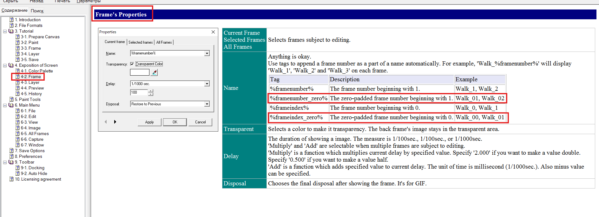
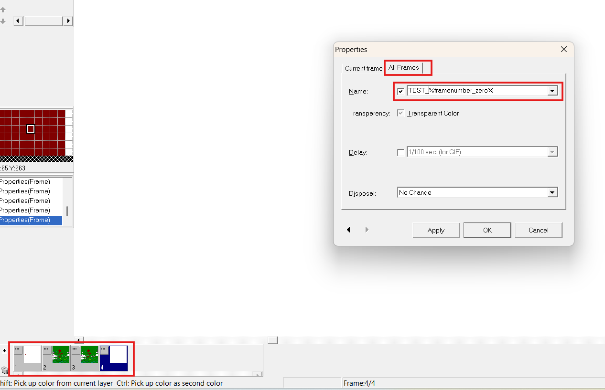
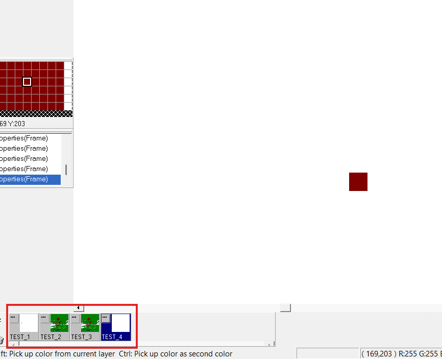
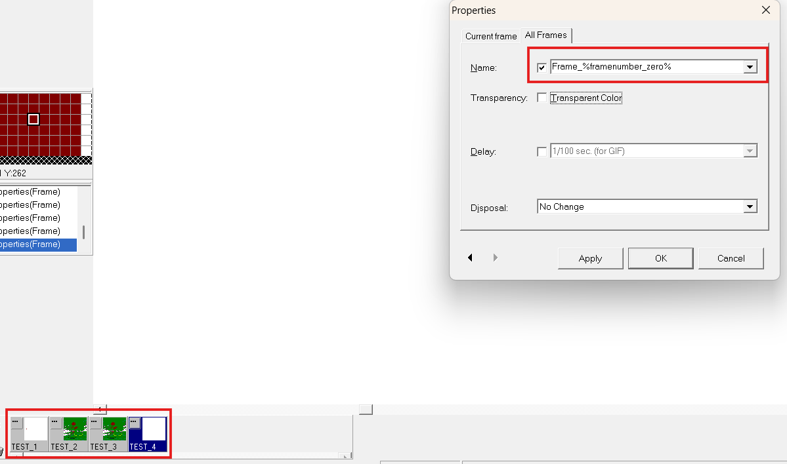
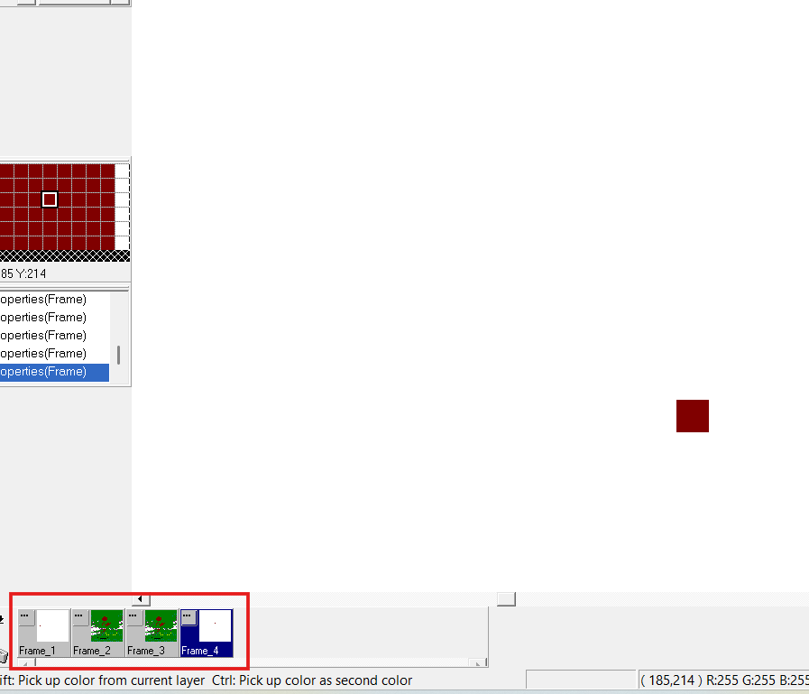

# GraphicsGale - Bug Report №2

## Title:
- The digit "0" is not displayed in the frame name when selecting the tag "%framenumber_zero%".

## Description:
- The bug was found during the third documentation testing session.

## Environment:
- OS: Windows 11;
- Version: 2.10.01.

## Steps:
1. Open the application and create a new canvas;
2. Open the "Properties" modal window by clicking on "..." in the frames section;
3. In the "Name" parameter, select the value "%framenumber_zero%";
4. Click the "OK" button.

## Expected result:
- The frame name changes from "1" to "01".

## Actual result:
- The frame name remains the same. The digit "0" is not added to the number one.

## Severity:
- Low.

## Priority:
- Minor.

## Evidence:

### Screenshot 1:

### Screenshot 2:

### Screenshot 3:

### Screenshot 4:

### Screenshot 5:

- Screenshots are located in the directory "Bugs/Documentation Testing Session3";
- File names:
- "documentation_testing_session3_bug5.png";
- "documentation_testing_session3_bug6.png";
- "documentation_testing_session3_bug7.png";
- "documentation_testing_session3_bug8.png";
- "documentation_testing_session3_bug9.png".
